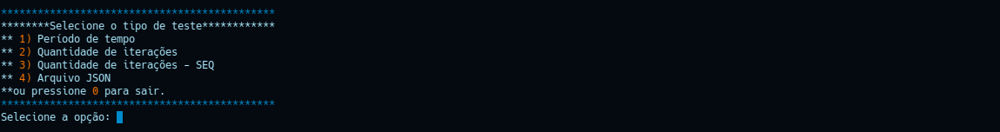
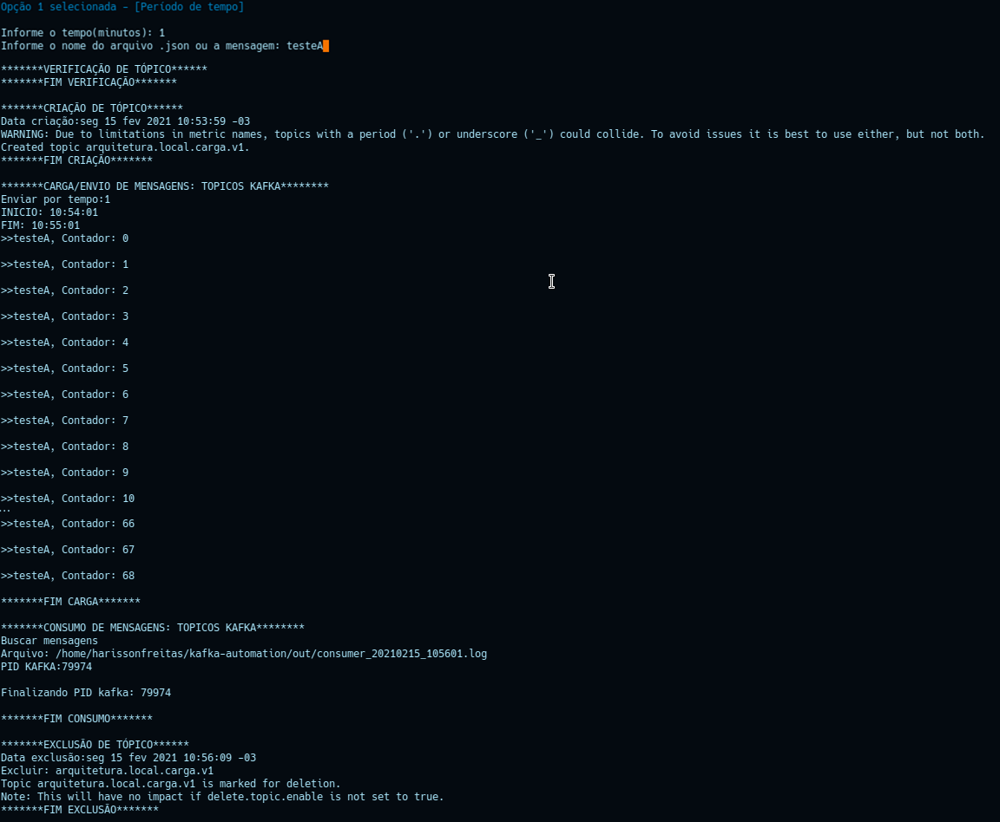
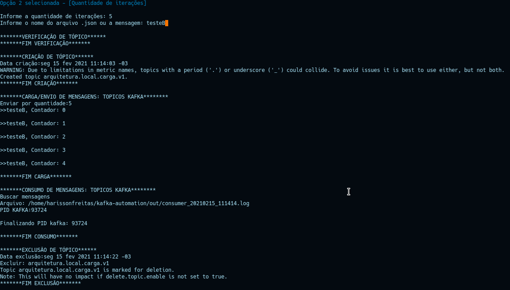
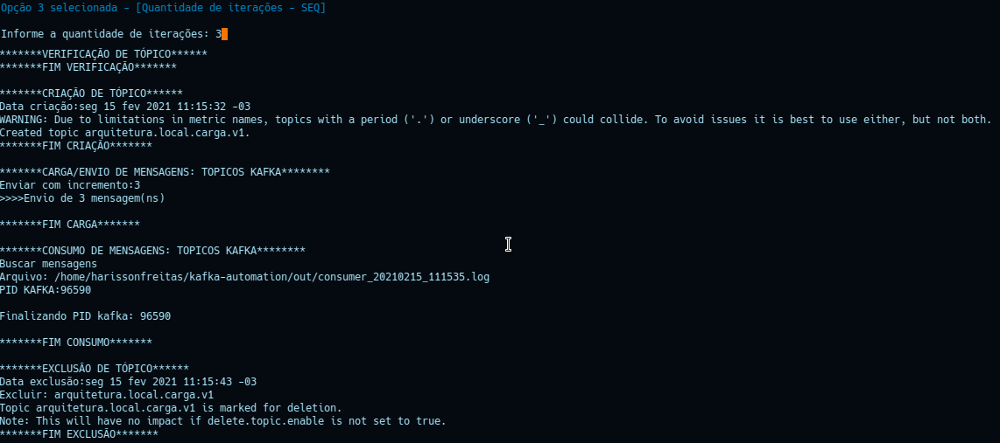
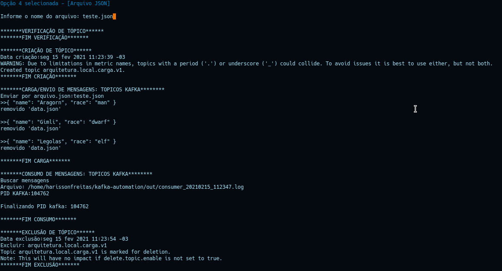

# Kafka Automation Test

## O que é o Kafka Automation?
É uma Ferramenta para criar, produzir, consumir e excluir eventos e tópicos do Kafka;<br/>

**_Por que criar uma ferramenta?_**<br/>
O motivo pelo qual a ferramenta foi criada, foi com o intuito de facilitar no processo de testes para<br/>
o envio e consumo mensagens, visto que em determinada ocasião necessitava realizar alguns testes<br/> 
produzindo mensagens por um determinado período de tempo, por uma quantidade especifíca e<br/>
através de um arquivo .json; Outro ponto que devo ressaltar, é que algumas ferramentas mais robustas<br/>
para esse tipo de automação como o **_Kafka Magic Tools_** só libera a funcionalidade através de uma assinatura.

**_Como a ferramenta funciona?_**<br/>
A ferramenta proprociona ao usuário 2 opções: 
- Executar um processo completo desde a criação do tópico, envio de mensagens, consumo de mensagens<br/>
e exclusão do tópico.
- Executar cada uma das operações abaixo separadamente:
  - Criar tópico;
  - Enviar mensagem;
  - Consumir mensagem;
  - Excluir tópico.

**_Criar Tópico:_**<br/>
Ao iniciar o processo de criação de um tópico, são utilizadas às variáveis **_$ZKS_** e **_$TOPIC,_**<br/>
como endereço do **server do zookeeper** e o **nome do tópico** respectivamente.

**_Enviar mensagem:_**<br/>
No processo de envio de mensagens, temos às seguintes opções:
 - **_Tempo_**: Define-se um período de tempo(minutos) ao qual serão enviadas mensagens para o tópico;
 - **_Quantidade_**: Define-se um valor de iterações ao qual serão envidas mensagens para o tópico;
 - **_Quantidade(Seq)_**: Define-se um valor de iterações utilizando o comando seq, no qual no corpo<br/> 
   da mensagem o valor será o número da iteração e que será enviada para o tópico;
 - **_Arquivo json_**: Cria-se um arquivo Json com à(s) mensagens a serem enviadas para o tópico.

São utilizadas às variáveis **_$BROKER_** e **_$TOPIC_**, como endereço do **server do kafka** e<br/>
**nome do tópico** respectivamente.

**_Consumir mensagem_**:<br/>
No processo de consumo de mensagens, são executadas às seguintes etapas:
 - Dispara o comando para consumir às mensagens;
 - Cria o diretório out se caso não existir;
 - Cria o arquivo consumer_%Y%m%d_%H%M%S.log com o conteúdo da mensagem consumida;
 - Se estiver executando no docker, irá matar o processo do docker exec;
 - Mata o processo do kafka-consumer.

São utilizadas às variáveis **_$BROKER_** e **_$TOPIC_**, como endereço do **server do kafka** e<br/>
**nome do tópico** respectivamente.

**_Excluir tópico_**:<br/>
No processo de exclusão do tópico, é verificado se o tópico existe e se existir executa a exclusão do tópico.<br/>
São utilizadas às variáveis **_$ZKS_** e **_$TOPIC_**, como endereço do **server do zookeeper** e o **nome do tópico**<br/> 
respectivamente.


## Configurações
- [Pré-requisitos](#Pré-requisitos)
- [Ambiente](#Configuração-Ambiente) 
- [Linux](#Configuração-Linux)
- [Windows](#Configuração-Windows)

## Utilização
- [Local(Linux)](#Utilização-em-ambiente-Linux(Local))
- [Docker(Linux/Windows)](#Utilização-em-ambiente-Linux/Windows(Docker))

## Execução
- [Execução Completa](#Execução-Completa:Start)
- [Execução Fracionada](#Execução-Fracionada)

## Pré-requisitos
 - [**_build-essential(Make)_**](#Instalando-Build-Essential)
 - [**_jq_**](#Instalando-jq)
 - [**_docker_**(Obrigatório para Windows)](#Instalando-Docker)

<br/>OBS: Para às instalações e configurações acima, se estiver utilizando o **_Windows_** deve-se cofigurar o Bash Shell de alguma das
<br/>distribuições de **_Linux_** homologadas.   

## Instalando Build Essential
 O build-essential é necessário para que tenhamos como executar o comando **_make_**(GNU Make) referente ao arquivo **_Makefile_**;
 <br/>Abra seu **_terminal(Linux Bash Shell no Windows)_**, e execute o seguinte comando:`sudo apt-get install build-essential`;
 <br/>Para verificar se instalou com sucesso, basta executar: `make --version` e deverá ter uma saída igual à:<br/> 

```
GNU Make 4.2.1
Compilado para x86_64-pc-linux-gnu
Copyright (C) 1988-2016 Free Software Foundation, Inc.
Licença GPLv3+: GNU GPL versão 3 ou posterior <http://gnu.org/licenses/gpl.html>
Isto é um aplicativo livre: você pode alterá-lo e redistribui-lo livremente.
NÃO HÁ GARANTIAS, exceto o que for permitido por lei.
```

## Instalando jq
O jq é um processador JSON de linha de comando leve e flexível, sendo como sed para dados JSON,você pode usá-lo para cortar,
<br/>filtrar, mapear e transformar dados estruturados com a mesma facilidade que sed, awk, grep.
<br/>Abra seu **_terminal(Linux Bash Shell no Windows)_**, e execute o seguinte comando:`sudo apt-get install jq`;
<br/>Para verificar se instalou com sucesso, basta executar: `jq --version` e deverá ter uma saída igual à:`jq-1.6`

## Instalando Docker
Docker é uma plataforma de código aberto, desenvolvido na linguagem Go e criada pelo próprio Docker.Inc. 
<br/>Por ser de alto desempenho, o software garante maior facilidade na criação e administração de ambientes isolados, 
<br/>garantindo a rápida disponibilização de programas para o usuário final.
<br/> Processo de instalação [aqui](#https://docs.docker.com/engine/install/)

## Configuração Ambiente
Antes de executar os testes, é necessário realizar às seguintes configurações:
   - Executar o comando `make config` para dar às permissões para tornar os scripts executáveis;
   - Abrir o arquivo **_bin/main.sh_** para configurar às varáveis abaixo:
     -  Gerais: <br/>
        
        | Nome                        | Descrição                                                           | Exemplo                                                                                                                                                                                         |          
        |:-------------               | :-------------                                                      | :-------------                                                                                                                                                                                  |
        | IS_DOCKER                   | Define se o server do Kafka está em execução em um container Docker | S(**_Docker_**), N(**_Local_**)                                                                                                                                                                 |
        | TOPIC                       | Tópico do Kafka                                                     | **_arquitetura.local.v1_**                                                                                                                                                                      |
        | BROKER                      | Endereço do broker Kafka                                            | **_localhost:9092_**                                                                                                                                                                            |
        | ZKS                         | Endereço do zookeeper                                               | **_localhost:2181_**                                                                                                                                                                            |
        | PATH_MAIN                   | Caminho principal do projeto                                        | **_${HOME}/kafka-automation_**                                                                                                                                                                  |
        | PATH_JSON                   | Caminho onde está o arquivo .json para teste                        | Se estiver executando fora de um container: **_${HOME}/testes/json_**; <br/>Se estiver executando dentro de um container: **_/home/harissonfreitas/kafka-docker/json_**                              |
        
     - Local - Sem Docker(Apenas para Linux):<br/>
       
        | Nome                        | Descrição                                                           | Exemplo                                           |          
        |:-------------               | :-------------                                                      | :-------------                                    |
        | PATH_KAFKA                  | Caminho onde está o diretório bin do Kafka                          | **_${HOME}/kafka_**                               |
        | PATH_OUT                    | Caminho onde são gerado os arquivos de saída(log)                   | **_${PATH_MAIN}/out_**                            |
     
     - Docker(Linux/Windows):<br/>  
       
        | Nome                        | Descrição                                                           | Exemplo                                           |          
        |:-------------               | :-------------                                                      | :-------------                                    |
        | PATH_DOCKER                 | Caminho do volume mapeado do docker - externo                       | **_/home/harissonfreitas/kafka-docker_**          |
        | PATH_DATA                   | Caminho docker para acesso ao arquivo .json - interno               | **_/ops/json_**                                   |
        | SO                          | Define o sistema operacional                                        | L/l(**_Linux_**) ou W/w(**_Windows_**)            |
    
## Configuração Linux
Basicamente no linux, foram homologados às seguindes distribuições:
- Ubuntu 16.+
- Kubuntu 16.+
- Mint 16.+
- Fedora 28.+(_A partir do fedora 32 há uma serie de conflitos com a engine do docker, sendo priorizado o uso do **podman**, 
  <br/> nesse caso oriento a não subir o server do Kafka através do docker_).<br/>

No Linux podemos tanto executar o server do Kafka localmente, quando dentro de um container docker. 
Porém ao optar pelo uso do **_DOCKER_** teremos que realizar à seguinte configuração:<br/>
- Ter o [docker](#Instalando-Docker) e docker-compose(opcional) instalados;
- Permissão para poder executar o comandos como root dentro do container:
  - Execute em seu terminal o comando `sudo visudo`;
  - Adicione o path do projeto kafka-automation na variável _**secure_path**_, no meu caso o meu path é<br/> 
    **_/home/harissonfreitas/kafka-automation_**:
    ```
    #
    # This file MUST be edited with the 'visudo' command as root.
    #
    # Please consider adding local content in /etc/sudoers.d/ instead of
    # directly modifying this file.
    #
    # See the man page for details on how to write a sudoers file.
    #
    Defaults        env_reset
    Defaults        mail_badpass
    Defaults        secure_path="/usr/local/sbin:/usr/local/bin:/usr/sbin:/usr/bin:/sbin:/bin:/snap/bin:/home/harissonfreitas/kafka-automation"

    # Host alias specification

    # User alias specification

    # Cmnd alias specification

    # User privilege specification
    root    ALL=(ALL:ALL) ALL

    # Members of the admin group may gain root privileges
    %admin ALL=(ALL) ALL

    # Allow members of group sudo to execute any command
    %sudo   ALL=(ALL:ALL) ALL

    # See sudoers(5) for more information on "#include" directives:

    #includedir /etc/sudoers.d
    ```
Para ambos(**_Local/Docker_**), realiza-se à seguinte configuração:
- Ter instalado o [**_build essential_**](#Instalando-Build-Essential);
- Ter instalado o [**_jq_**](#Instalando-jq);  
- Dar permissão e tornar os scripts executáveis:
   - Através do terminal, acessar o diretório do projeto e executar o comando: `make config`;
    <br/> Basicamente será executado um `chmod +x bin/*.sh` permitndo que os arquivos .sh
    <br/> sejam executáveis.
- Se for utilizar arquivo **_.json_** para teste:
   - criar o arquivo em um diretório local ao qual deverá ser atribuido a variável **_$PATH_JSON_**;
   - criar o arquivo em um diretório detro do volume mapeado no docker ao qual deverá ser atribuido a variável **_$PATH_JSON_**.

## Configuração Windows
  Basicamente no Windows o server do Kafka foi executado em um container docker, e homologado na seguinte versão:
- Windows 10 <br/>

  Para realizar o processo de configuração no Windows, precisamos basicamente:
- Instalar o [WSL/WSL2](#https://docs.microsoft.com/pt-br/windows/wsl/install-win10) depende do build da versão do Windows
  <br/> e instalando um bash de acordo com às versões homologadas para Linux;
- Ter o [docker](#Instalando-Docker) instalado;
- Ter instalado o [**_build essential_**](#Instalando-Build-Essential);
- Ter instalado o [**_jq_**](#Instalando-jq);   
- Dar permissão e tornar os scripts executáveis:
      - Através do terminal, acessar o diretório do projeto e executar o comando: `make config`;
  <br/> Basicamente será executado um `chmod +x bin/*.sh` permitndo que os arquivos .sh
  <br/> sejam executáveis.

## Utilização em ambiente Linux(Local)
Após realizar às configurações descritas anteriormente, seguem os passos para a execução:
- Executar o comando `bin/zookeeper-server-start.sh config/zookeeper.properties &` para subir o server do **_zookeeper_**;
- Executar o comando `bin/kafka-server-start.sh config/server.proprties &` para subir o server do **_kafka_**.

## Utilização em ambiente Linux/Windows(Docker) 
- Executar o container com o server do **_zookeeper_**;
- Executar o container com o server do **_kafka_**;

## Execução Completa:Start
Para a execução do fluxo completo, executar o seguinte comando:
- Se estiver rodando dentro de um container docker: `sudo make start`, porém se estiver rodando local somente `make start`; 
  <br/>Em ambos os casos irá abrir o painel abaixo:<br/>
  
  
Basicamente temos 4 tipos de testes:
- Período de **_tempo_**: O usuário define em minutos a quantidade de tempo que quer que sejam enviadas e consumidas às mensagens do tópico.
<br/> Nesse cenário ocorre a criação do tópico, o envio e consumo de mensagens e a exclusão do tópico, conforme abaixo:
  
  
- Por **_quantidade_** de iterações definidas: O usuário define uma quantidade de iterações para o envio e consumo de mensagens do tópico.
  <br/> Nesse cenário ocorre a criação do tópico, o envio e consumo de mensagens e a exclusão do tópico, conforme abaixo:
  
  
- Por **_quantidade_** de iterações definidas utilizando **_seq_**: O usuário define uma quantidade de iterações, porém aqui não é informado um valor<br/>
para a mensagem, o conteúdo da mensagem é proveniente da quantidade de iterações definidas.
  <br/> Nesse cenário ocorre a criação do tópico, o envio e consumo de mensagens e a exclusão do tópico, conforme abaixo:
  

- Por arquivo **_.json_**: O usuário pode enviar suas mensagens através de um arquivo JSON no seguinte formato:
  ```
  {
    "messages": [
      /*Mensagem(ns) do usuário*/
    ]
  }
  ```  
   - Dentro do array **_messages_** irá o conteúdo que será enviado e consumido no momento da execução dos testes. 
     <br/>Internamente quando o arquivo é lido, ele busca pela lista **_message_** para extrair às mensagens, conforme exemplo abaixo:
     ```
     {
        "messages": [
           {
              "name": "Aragorn",
              "race": "man"
           },
           {
              "name": "Gimli",
              "race": "dwarf"
           },
           {
              "name": "Legolas",
              "race": "elf"
           }
        ]
     }
     ```
   <br/>Nesse cenário ocorre a criação do tópico, o envio e consumo de mensagens e a exclusão do tópico, conforme abaixo:
   

Observação: **Para os testes por período e por quantidade que não use seq, também podem ser enviados arquivos json, 
<br/>porém em uma certa etapa dos testes os mesmos irão repetir os valores interados para envio.**

## Execução Fracionada
Além dos testes completos listados acima, podemos realizar os seguintes testes de forma separada:
- Criação de tópico: Utilizar o comando `make create` que irá criar o tópico de acordo com o nome configurado;
- Envio de mensagens: 
  - Por período:
     - Local: `make time=1 value=testeA produce-time`;
     - Docker: `sudo make time=1 value=testeA produce-time`.
    
  - Por quantidade:
      - Local: `make quantity=10 value=testeB produce-quantity`;
      - Docker: `sudo make quantity=10 value=testeB produce-quantity`.
    
  - Por quantidade(Seq):
      - Local: `make quantity=10 value=testeB produce-seq`;
      - Docker: `sudo make quantity=10 produce-seq`.
    
  - Por arquivo .json:
      - Local: `make value=teste.json produce-quantity`;
      - Docker: `sudo make value=teste.json produce-quantity`.
    
- Consumo de mensagens: Utilizar o comando `make consume` para consumr às mensagens;
- Exclusão de tópico: Utilizar o comando `make delete` para excluir o tópico.


  
  
